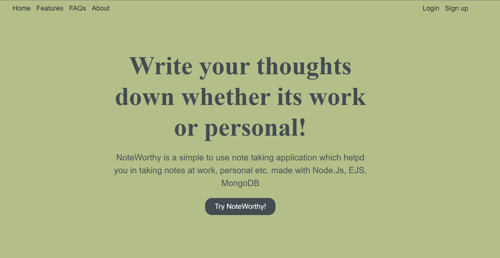

# NoteWorthy



<div align='center'>

NoteWorthy is an innovative web application that revolutionizes note-taking and organization. Built using Node.js, Express.js,and MongoDB. Users can effortlessly create, manage, and find notes with smart tags, optimizing productivity and decluttering their digital workspace. With its user-friendly interface and real-time updates, NoteWorthy elevates the note-taking experience, providing a seamless and intelligent solution for organizing thoughts and ideas.
</div>

Deployed link : https://thankful-kimono-crow.cyclic.cloud/

### Tech Stack

 

### Contributing


* Fork and Star the project.

* Clone the repo on your local machine.

```bash
git clone https://github.com/akanksha2305/NoteWorthy
```

* Create a new branch `<Your_GitHub_username>` and switch to it with 

```bash
git checkout -b <GitHub_usename>
```

* Go to the issues tab and comment on a suitable issue of your choice and wait for the issue to be assigned to you.

* Make the changes in your local repo and push the changes.
* Create a pull request to the main branch.
* Wait for the PR to be reviewed and merged.


## Happy Contributing !
